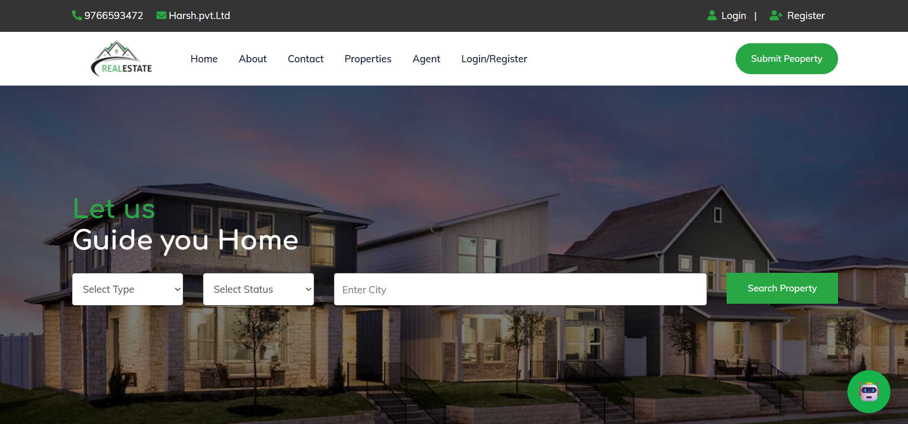
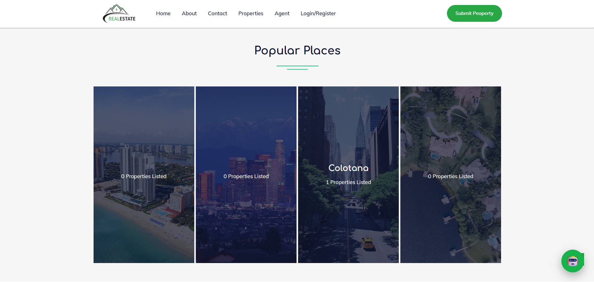
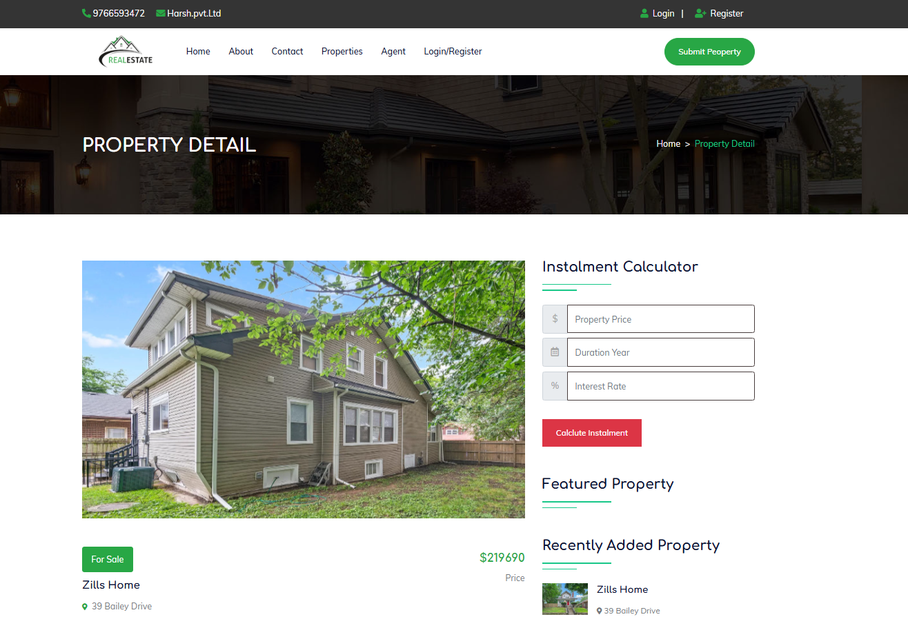
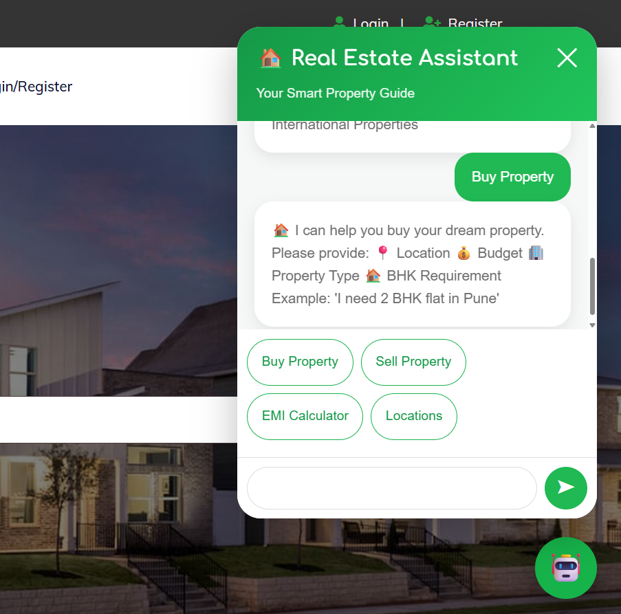
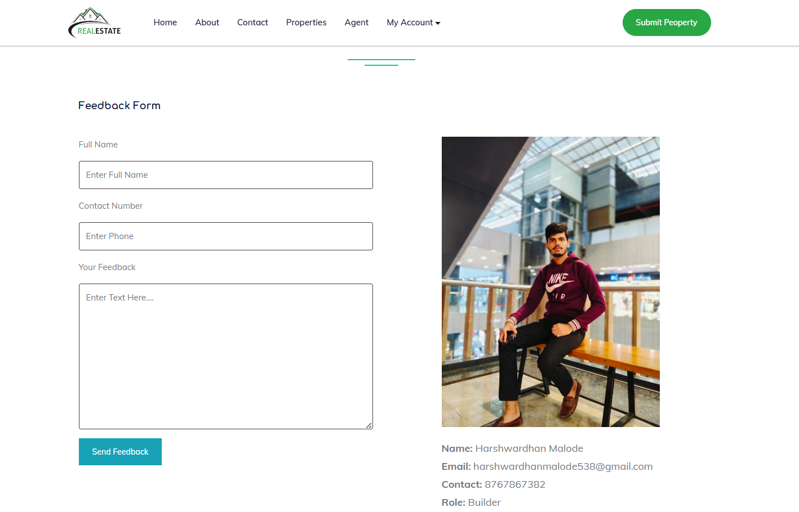
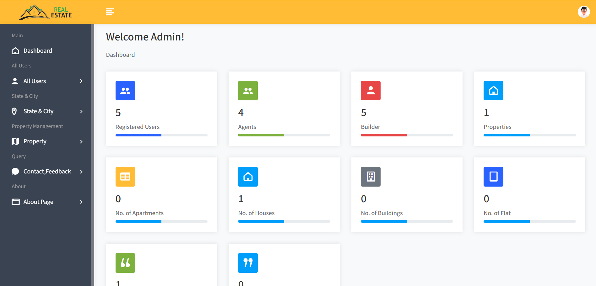
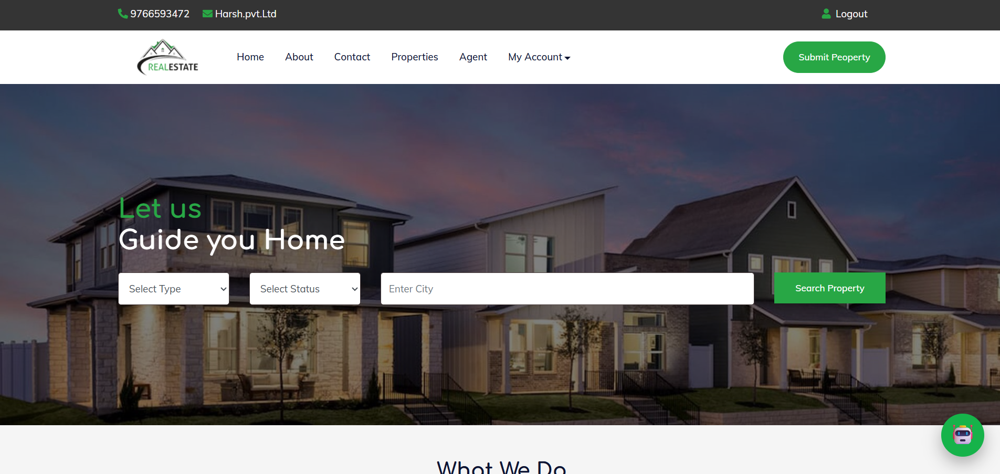
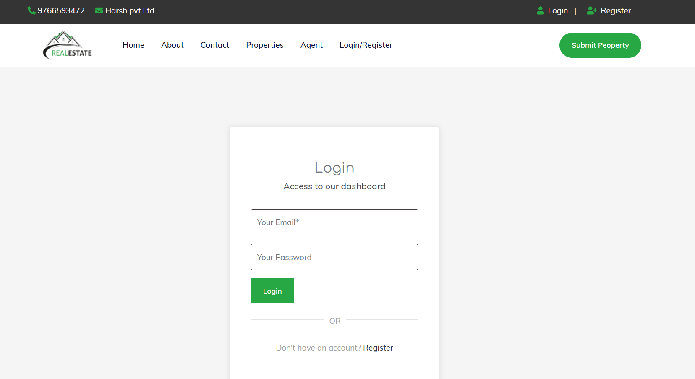

<h1 align = "center"> 🏡 EstateSphere - AI</h1>

<p align="center">
  
  
  
  
  
  
  
</p>

## 🏘️ Smart Real Estate Discovery & Management Platform

A complete real estate management platform that enables administrators, builders, and users to manage property listings, discover properties, communicate through an AI-powered chatbot, and streamline the buying and selling experience using a single web application.

🌐 **Live Demo:** Coming Soon

💻 **GitHub Repository:** https://github.com/HarshMalode/EstateSphere-AI

---

# 📸 Dashboard Preview

**Home**

<p align="center">
  
</p>

---

# 🔥 Why EstateSphere AI?

Searching for the right property and managing listings manually can be time-consuming for buyers, builders, and administrators.

EstateSphere AI simplifies the entire real estate process by providing a centralized platform where each user has dedicated responsibilities based on their role.

The platform enhances property discovery with smart search, efficient management tools, and an AI-powered chatbot that assists users throughout their property journey.

---

# 🚀 Key Highlights

🏡 AI-powered Real Estate Management Platform <br>
👤 Three Role-Based Modules (User, Builder & Admin) <br>
🤖 Intelligent Property Assistance using AI Chatbot <br>
🔍 Smart Property Search with Advanced Filters <br>
❤️ Wishlist & Property Inquiry System <br>
📱 Fully Responsive User Interface <br>
🔐 Secure Authentication & Session Management <br>
📊 Interactive Admin Dashboard

---

# ✨ Features

## 👤 User Module

Users can:

- Register & Login
- Browse Property Listings
- Search Properties by Location, Budget & Category
- View Detailed Property Information
- Save Properties to Wishlist
- Send Property Inquiries
- Chat with AI Assistant
- Manage Profile Information

---

## 🏗️ Builder Module

Builders can:

- Secure Registration & Login
- Add New Property Listings
- Upload Property Images
- Edit Property Details
- Delete Property Listings
- Manage Property Availability
- View Customer Inquiries
- Monitor Listed Properties
- Manage Builder Profile

---

## 👨‍💻 Administrator Module

Administrators can:

- Manage Users
- Manage Builders
- Approve or Reject Property Listings
- Manage Property Categories
- Monitor Platform Activity
- View Dashboard Statistics
- Remove Inappropriate Listings
- Control the Complete Platform

> Properties become visible to users only after they are approved by the administrator.

---

## 🤖 AI Chatbot

The integrated AI chatbot helps users by:

- Answering property-related questions
- Recommending suitable properties
- Guiding users through buying & selling
- Assisting with website navigation
- Providing instant support 24×7

---

# 📊 Dashboard & Analytics

EstateSphere AI provides useful insights to administrators and builders through interactive dashboards.

Available analytics include:

- Total Properties
- Active Builders
- Property Categories
- Customer Inquiries
- Recently Added Properties
- Platform Statistics

---

# 🛡 Security

EstateSphere AI follows secure development practices including:

- Role-Based Authentication
- Secure Login System
- Session Management
- Protected Dashboards
- Input Validation
- Database Security

---

# 🛠️ Technologies Used

## Frontend

- HTML5
- CSS3
- JavaScript
- Bootstrap

## Backend

- PHP

## Database

- MySQL

## Development Tools

- Visual Studio Code
- XAMPP
- Git
- GitHub

---

# 🧩 Project Structure

```
EstateSphere-AI/
├── admin/
├── builder/
├── user/
├── chatbot/
├── assets/
├── uploads/
├── database/
├── screenshots/
├── index.php
├── login.php
├── register.php
└── README.md
```

---

# 📸 Screenshots

| Home | Property Listings |
|------|-------------------|
|  |  |

| Property Details | AI Chatbot |
|------------------|------------|
|  |  |

| Builder Dashboard | Admin Dashboard |
|-------------------|-----------------|
|  |  |

| User Dashboard | Login |
|---------------|-------|
|  |  |

---

# 🌟 Use Cases

- Property Discovery
- Property Buying & Selling
- Builder Property Management
- Property Listing Management
- AI-Based Customer Assistance
- Property Inquiry Management
- Real Estate Administration
- Multi-Role Property Platform

---

# 🚀 Installation

### Clone the Repository

```bash
git clone https://github.com/HarshMalode/EstateSphere-AI.git
```

- Move the project into your **XAMPP htdocs** folder.

- Import the provided SQL database into **MySQL**.

- Start **Apache** and **MySQL** from XAMPP.

- Open the project in your browser:

```
http://localhost/EstateSphere-AI
```

---

# 🚧 Future Enhancements

- Property Recommendation Engine
- AI-Based Property Price Prediction
- Google Maps Integration
- Mortgage & EMI Calculator
- Virtual Property Tours
- Email & SMS Notifications
- Property Reviews & Ratings
- Mobile Application

---

# 🎯 Project Objectives

- Simplify property discovery for buyers.
- Help builders manage property listings efficiently.
- Provide centralized administration of the platform.
- Improve customer engagement using AI-powered assistance.
- Deliver a responsive and user-friendly experience across devices.

---

# 🤝 Contributing

Contributions are welcome!

If you have ideas to improve EstateSphere AI, feel free to:

- Fork the repository
- Create a new branch
- Commit your changes
- Submit a Pull Request 🚀

---

# 📄 License

This project is licensed under the **MIT License**.

---

# 📬 Contact

### 👨‍💻 Developed by - **Harsh Malode**

📧 Email: harshwardhanmalode798@gmail.com

🔗 LinkedIn: https://www.linkedin.com/in/harshwardhan-malode-226900386

🐙 GitHub: https://github.com/HarshMalode

🌐 Portfolio: Coming Soon

---

# ⭐ If you found this project useful

⭐ Star this repository

🔁 Share it with others

💼 Connect with me on LinkedIn
